# Real Estate Agentic AI

A simple multi-agent system for real estate queries. It helps users find properties, check legal compliance, and get valuations by coordinating specialized AI agents.

## What It Does

- Analyzes user queries about real estate
- Routes requests to specialized agents (search, legal, valuation)
- Returns helpful insights and recommendations

---

## Architecture

```mermaid
%%{init: {'theme':'base', 'themeVariables': { 'primaryColor':'#fff3e0','primaryTextColor':'#000','primaryBorderColor':'#ff9900','lineColor':'#ff9900','secondaryColor':'#e3f2fd','tertiaryColor':'#f3e5f5'}}}%%
graph TB
    User([👤 User]):::userStyle
    
    subgraph AWSCloud["☁️ AWS Cloud"]
        direction TB
        
        subgraph Compute["⚡ AWS Lambda & API Gateway"]
            APIGW[🌐 AWS API Gateway<br/>HTTP Endpoint]:::apigwStyle
            LambdaAPI[🔶 Lambda: Backend API<br/>FastAPI Handler]:::lambdaStyle
            SQS[📨 AWS SQS Queue<br/>Async Processing]:::sqsStyle            
        end

        subgraph MultiStageAgent["🎯 Multi Stage Agents"]
          LambdaPlanner[🔶 Lambda: Planner Agent<br/>LLM Analysis]:::plannerStyle
          LambdaLegal[🔶 Lambda: Legal Agent<br/>LLM Analysis]:::legalStyle
          LambdaSubAgents[🔶 Lambda: Sub Agents<br/>LLM Analysis]:::subAgentStyle
        end
        
        subgraph Storage["💾 AWS Data & Storage Services"]
            DB[(🗄️ Amazon Aurora<br/>PostgreSQL)]:::dbStyle
            S3Vector[📦 S3 Vector Storage<br/>Embeddings & RAG]:::s3Style
        end
        
        subgraph AI["🤖 AWS AI/ML Services"]
            LLM[🤖 AWS Bedrock<br/>Claude Sonnet]:::llmStyle
            SageMaker[🧠 SageMaker Endpoint<br/>Embeddings Model]:::sagemakerStyle
        end
        
        style Compute fill:#fff3e0,stroke:#ff9900,stroke-width:3px
        style MultiStageAgent fill:#f3e5f5,stroke:#9c27b0,stroke-width:3px
        style Storage fill:#e3f2fd,stroke:#2196f3,stroke-width:3px
        style AI fill:#e0f7fa,stroke:#00bcd4,stroke-width:3px
        
        APIGW --> LambdaAPI
        LambdaAPI --> SQS
        LambdaAPI --> DB
        SQS --> LambdaPlanner
        LambdaPlanner --> LambdaLegal
        LambdaPlanner --> LambdaSubAgents
        LambdaPlanner --> DB
        LambdaPlanner --> LLM
        LambdaPlanner --> SageMaker
        LambdaPlanner --> S3Vector

        LambdaLegal --> DB
        LambdaLegal --> LLM
        LambdaLegal --> SageMaker
        LambdaLegal --> S3Vector

        LambdaSubAgents --> DB
        LambdaSubAgents --> LLM
        LambdaSubAgents --> SageMaker
        LambdaSubAgents --> S3Vector

        
    end
    
    User --> APIGW
    
    Shared[📚 Shared Modules<br/>Models & Repository]:::sharedStyle
    LambdaAPI -.- Shared
    LambdaPlanner -.- Shared
    LambdaLegal -.- Shared
    LambdaSubAgents -.- Shared
    
    style AWSCloud fill:#f5f5f5,stroke:#607d8b,stroke-width:4px,stroke-dasharray: 5 5
    
    classDef userStyle fill:#e1f5ff,stroke:#0288d1,stroke-width:2px,color:#000
    classDef apigwStyle fill:#ff9900,stroke:#ff6600,stroke-width:3px,color:#fff
    classDef lambdaStyle fill:#ff9900,stroke:#ff6600,stroke-width:3px,color:#fff
    classDef sqsStyle fill:#ff6b9d,stroke:#c2185b,stroke-width:2px,color:#fff
    classDef plannerStyle fill:#9c27b0,stroke:#6a1b9a,stroke-width:3px,color:#fff
    classDef legalStyle fill:#673ab7,stroke:#4527a0,stroke-width:3px,color:#fff
    classDef subAgentStyle fill:#3f51b5,stroke:#283593,stroke-width:3px,color:#fff
    classDef dbStyle fill:#2196f3,stroke:#1565c0,stroke-width:2px,color:#fff
    classDef llmStyle fill:#00bcd4,stroke:#006064,stroke-width:2px,color:#fff
    classDef sagemakerStyle fill:#00bcd4,stroke:#006064,stroke-width:2px,color:#fff
    classDef s3Style fill:#569a31,stroke:#2d5016,stroke-width:2px,color:#fff
    classDef sharedStyle fill:#e8f5e9,stroke:#388e3c,stroke-width:2px,color:#000
```

## How It Works

1. User sends a query via API Gateway
2. Backend API processes the request and queues it
3. Planner Agent analyzes the query and coordinates other agents
4. Specialized agents (Legal, Search, etc.) handle specific tasks
5. Results are stored and returned to the user

## Tech Stack

- **AWS Lambda** - Serverless compute
- **API Gateway** - HTTP endpoints
- **Aurora PostgreSQL** - Database
- **Bedrock (Claude)** - AI/LLM capabilities
- **SageMaker** - ML embeddings
- **S3** - Vector storage

For detailed architecture, visit [our docs](https://open-estate-ai.github.io/real-estate-docs/architecture/overview/)

## Getting Started

See the [backend README](backend/README.md) for local development and testing instructions.

