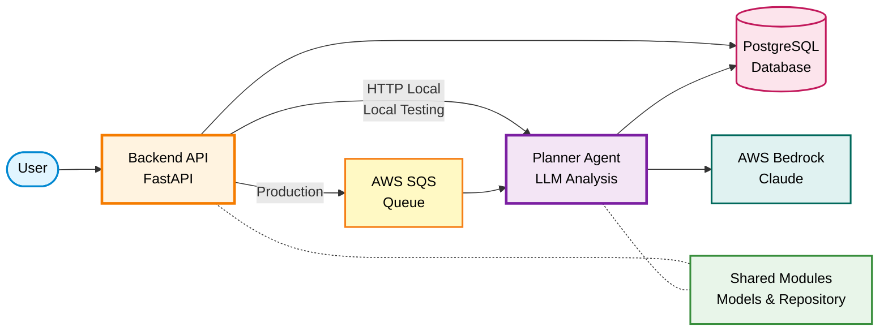

# Backend

Multi-agent system for real estate AI with layered architecture.

## What's Inside

- **API Service** - Entry point that receives user queries and coordinates agents
- **Agents** - Specialized services (Planner, Search, Valuation, etc.)
- **Shared** - Common modules for database, models, and utilities

## Local Development

Run all services with Tilt:

```bash
cd real-estate-agentic-ai
tilt up
```

This starts:
- Backend API on port 9000
- Planner Agent on port 8081
- PostgreSQL database

## Architecture



**Component Colors:**
- 🟠 **Orange** - API Service (Entry point)
- 🟣 **Purple** - Agents (Business logic)
- 🟢 **Green** - Shared Modules (Common code)
- 🔴 **Pink** - Database (Data storage)
- 🔵 **Teal** - External LLM (AWS Bedrock)
- 🟡 **Yellow** - AWS SQS (Message queue for production)

The system uses a clean layered architecture:
- **API Layer** - HTTP endpoints and request handling
- **Service Layer** - Business logic and orchestration
- **Repository Layer** - Database operations
- **Model Layer** - Data structures and schemas

## Components

### Backend API Service

Entry point for the system. Routes requests to appropriate agents.

[See API README](api/README.md) for details on:
- Running locally with Tilt
- Testing endpoints
- Running as Lambda locally
- Environment variables

### Agents

#### Planner Agent

The first agent in the pipeline. Reads from SQS, analyzes queries with LLM, creates execution plans.

[See Planner Agent README](agents/planner/README.md) for details on:
- Running locally with Tilt
- Testing with sample queries
- Running as Lambda locally
- Lambda deployment

### Shared Modules

Common code used across all services.

**Database Module:**
- SQLAlchemy models (Job, etc.)
- Repository layer for CRUD operations
- Database session management

**Location:** `shared/`

## Quick Test

Test the full flow locally:

```bash
# Submit a query
curl -X POST http://localhost:9000/api/analyze \
  -H "Content-Type: application/json" \
  -d '{
    "query": "Find 3BHK apartments in Noida under 1 crore",
    "user_id": "user-123"
  }'

# Check status (use job_id from response)
curl http://localhost:9000/api/jobs/{job_id}
```

## Project Structure

```
backend/
├── api/                    # Backend API service
│   ├── src/
│   │   ├── main.py        # FastAPI app
│   │   ├── lambda_handler.py
│   │   ├── clients/       # HTTP clients
│   │   └── services/      # Business logic
│   ├── Dockerfile
│   ├── Dockerfile.lambda
│   └── README.md
├── agents/
│   └── planner/           # Planner agent
│       ├── src/
│       │   ├── main.py    # FastAPI app
│       │   ├── lambda_handler.py
│       │   ├── planner.py # LLM logic
│       │   └── services/  # Business logic
│       ├── Dockerfile
│       ├── Dockerfile.lambda
│       └── README.md
└── shared/                # Shared modules
    ├── __init__.py
    ├── database/
    │   ├── models.py      # SQLAlchemy models
    │   ├── repository.py  # Data access layer
    │   └── session.py     # DB connection
    └── pyproject.toml
```
