# Backend

Multi-agent system for real estate AI with layered architecture.

## What's Inside

- **API Service** - Entry point that receives user queries and coordinates agents
- **Agents** - Specialized services (Planner, Search, Valuation, etc.)
- **Shared** - Common modules for database, models, and utilities

## Local Development

Run all services with Tilt:

```bash
cd real-estate-agentic-ai
tilt up
```

This starts:
- Backend API on port 8080
- Planner Agent on port 8081
- PostgreSQL database

## Architecture

```mermaid
%%{init: {'theme':'base', 'themeVariables': { 'primaryColor':'#fff3e0','primaryTextColor':'#000','primaryBorderColor':'#ff9900','lineColor':'#ff9900','secondaryColor':'#e3f2fd','tertiaryColor':'#f3e5f5'}}}%%
graph TB
    User([👤 User]):::userStyle
    
    subgraph AWSCloud["☁️ AWS Cloud"]
        direction TB
        
        subgraph Compute["⚡ AWS Lambda & API Gateway"]
            APIGW[🌐 AWS API Gateway<br/>HTTP Endpoint]:::apigwStyle
            LambdaAPI[🔶 Lambda: Backend API<br/>FastAPI Handler]:::lambdaStyle
            SQS[📨 AWS SQS Queue<br/>Async Processing]:::sqsStyle            
        end

        subgraph MultiStageAgent["🤖 Multi Stage Agents"]
          LambdaPlanner[🔶 Lambda: Planner Agent<br/>LLM Analysis]:::lambdaStyle
          LambdaLegal[🔶 Lambda: Legal Agent<br/>LLM Analysis]:::lambdaStyle
          LambdaSubAgents[🔶 Lambda: Sub Agents<br/>LLM Analysis]:::lambdaStyle
        end
        
        subgraph Storage["💾 AWS Data & Storage Services"]
            DB[(🗄️ Amazon Aurora<br/>PostgreSQL)]:::dbStyle
            S3Vector[📦 S3 Vector Storage<br/>Embeddings & RAG]:::s3Style
        end
        
        subgraph AI["🤖 AWS AI/ML Services"]
            LLM[🤖 AWS Bedrock<br/>Claude Sonnet]:::llmStyle
            SageMaker[🧠 SageMaker Endpoint<br/>Embeddings Model]:::sagemakerStyle
        end
        
        APIGW --> LambdaAPI
        LambdaAPI --> SQS
        LambdaAPI --> DB
        SQS --> LambdaPlanner
        LambdaPlanner --> LambdaLegal
        LambdaPlanner --> LambdaSubAgents
        LambdaPlanner --> DB
        LambdaPlanner --> LLM
        LambdaPlanner --> SageMaker
        LambdaPlanner --> S3Vector

        LambdaLegal --> DB
        LambdaLegal --> LLM
        LambdaLegal --> SageMaker
        LambdaLegal --> S3Vector

        LambdaSubAgents --> DB
        LambdaSubAgents --> LLM
        LambdaSubAgents --> SageMaker
        LambdaSubAgents --> S3Vector

        
    end
    
    User --> APIGW
    
    Shared[📚 Shared Modules<br/>Models & Repository]:::sharedStyle
    LambdaAPI -.- Shared
    LambdaPlanner -.- Shared
    LambdaLegal -.- Shared
    LambdaSubAgents -.- Shared
    
    classDef userStyle fill:#e1f5ff,stroke:#0288d1,stroke-width:2px,color:#000
    classDef apigwStyle fill:#ff9900,stroke:#ff6600,stroke-width:3px,color:#fff
    classDef lambdaStyle fill:#ff9900,stroke:#ff6600,stroke-width:3px,color:#fff
    classDef sqsStyle fill:#ff6b9d,stroke:#c2185b,stroke-width:2px,color:#fff
    classDef dbStyle fill:#3f51b5,stroke:#1a237e,stroke-width:2px,color:#fff
    classDef llmStyle fill:#00bcd4,stroke:#006064,stroke-width:2px,color:#fff
    classDef sagemakerStyle fill:#00bcd4,stroke:#006064,stroke-width:2px,color:#fff
    classDef s3Style fill:#569a31,stroke:#2d5016,stroke-width:2px,color:#fff
    classDef sharedStyle fill:#e8f5e9,stroke:#388e3c,stroke-width:2px,color:#000
```



## AWS Cloud Architecture

### ☁️ AWS Cloud Flow

**User Request Flow:**
1. **👤 User** → HTTP request
2. **🌐 AWS API Gateway** → Routes request to Lambda
3. **🔶 Lambda (Backend API)** → Processes request, sends to SQS
4. **📨 SQS Queue** → Asynchronous message delivery
5. **🔶 Lambda (Planner Agent)** → LLM analysis & job processing
6. **Storage & AI** → Database writes, vector search, LLM inference

### AWS Services by Category

**Compute & Networking** (Orange):
- **API Gateway** - Managed HTTP endpoint with SSL/TLS
- **Lambda Functions** - Serverless compute for API and agent logic

**Messaging** (Pink):
- **SQS** - Message queue for reliable async processing

**Data & Storage** (Blue/Green):
- **Aurora PostgreSQL** - Managed relational database
- **S3 Vector Storage** - Object storage for embeddings

**AI/ML** (Cyan):
- **Bedrock** - Managed LLM service (Claude Sonnet) for text generation
- **SageMaker Endpoint** - ML inference endpoint for embeddings generation

**Shared Code** (Light Green):
- **Shared Modules** - Common code used by all Lambda functions

### Local Development
For local testing, use Tilt to run FastAPI services on ports 8080 (API) and 8081 (Planner). See [Testing](#quick-test) section below.

The system uses a clean layered architecture:
- **API Layer** - HTTP endpoints and request handling
- **Service Layer** - Business logic and orchestration
- **Repository Layer** - Database operations
- **Model Layer** - Data structures and schemas

## Components

### Backend API Service

Entry point for the system. Routes requests to appropriate agents.

[See API README](api/README.md) for details on:
- Running locally with Tilt
- Testing endpoints
- Running as Lambda locally
- Environment variables

### Agents

#### Planner Agent

The first agent in the pipeline. Reads from SQS, analyzes queries with LLM, creates execution plans.

[See Planner Agent README](agents/planner/README.md) for details on:
- Running locally with Tilt
- Testing with sample queries
- Running as Lambda locally
- Lambda deployment

### Shared Modules

Common code used across all services.

**Database Module:**
- SQLAlchemy models (Job, etc.)
- Repository layer for CRUD operations
- Database session management

**Location:** `shared/`

## Local Test

Test the full flow locally:

```bash
# Submit a query
curl -X POST http://localhost:9000/api/analyze \
  -H "Content-Type: application/json" \
  -d '{
    "query": "Find 3BHK apartments in Noida under 1 crore",
    "user_id": "user-123"
  }'

# Check status (use job_id from response)
curl http://localhost:9000/api/jobs/{job_id}
```

## Test via API Gateway (Post-Deployment)

After deploying with API Gateway, you can test the endpoints directly via HTTP:

### Set API Gateway URL

```bash
export API_GATEWAY_URL="https://<api-gateway-id>.execute-api.us-east-1.amazonaws.com"
```

### Submit Analysis Request

```bash
curl -X POST ${API_GATEWAY_URL}/api/analyze \
  -H "Content-Type: application/json" \
  -d '{
    "user_id": "user-123",
    "request_payload": {
      "user_query": "Find 3BHK apartments in Noida under 1 crore"
    }
  }'
```

**Expected Response:**
```json
{
  "job_id": "b0537f4e-7a27-47b6-bc7a-5310ac2de943",
  "message": "Query submitted for analysis",
  "sqs_message_id": "abc123..."
}
```

### Get Job Status

```bash
# Replace with actual job_id from analyze response
export JOB_ID="b0537f4e-7a27-47b6-bc7a-5310ac2de943"

curl -X GET "${API_GATEWAY_URL}/api/jobs/${JOB_ID}" \
  -H "accept: application/json"
```

**Expected Response:**
```json
{
  "job_id": "b0537f4e-7a27-47b6-bc7a-5310ac2de943",
  "type": "planning",
  "status": "completed",
  "request_payload": {
    "user_query": "Find 3BHK apartments in Noida under 1 crore"
  },
  "output": {
    "plan": "..."
  }
}
```

### Health Check

```bash
curl -X GET "${API_GATEWAY_URL}/api/health" \
  -H "accept: application/json"
```

## Project Structure

```
backend/
├── api/                    # Backend API service
│   ├── src/
│   │   ├── main.py        # FastAPI app
│   │   ├── lambda_handler.py
│   │   ├── clients/       # HTTP clients
│   │   └── services/      # Business logic
│   ├── Dockerfile
│   ├── Dockerfile.lambda
│   └── README.md
├── agents/
│   └── planner/           # Planner agent
│       ├── src/
│       │   ├── main.py    # FastAPI app
│       │   ├── lambda_handler.py
│       │   ├── planner.py # LLM logic
│       │   └── services/  # Business logic
│       ├── Dockerfile
│       ├── Dockerfile.lambda
│       └── README.md
└── shared/                # Shared modules
    ├── __init__.py
    ├── database/
    │   ├── models.py      # SQLAlchemy models
    │   ├── repository.py  # Data access layer
    │   └── session.py     # DB connection
    └── pyproject.toml
```
